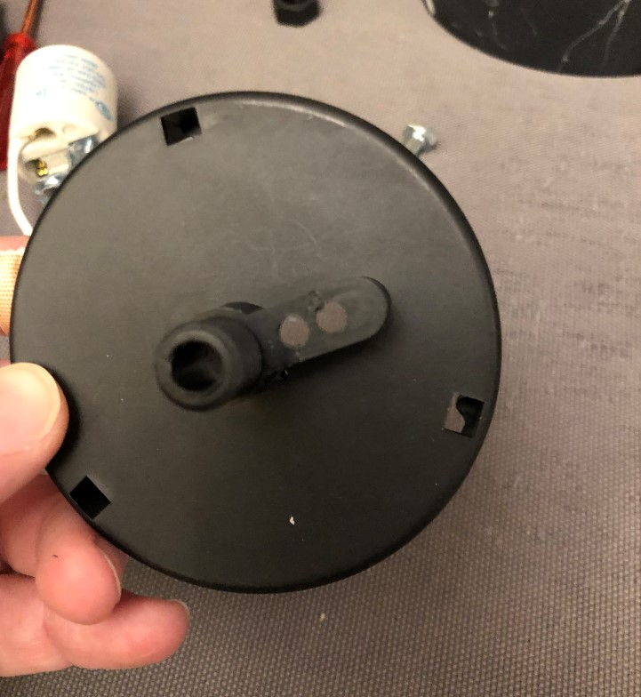
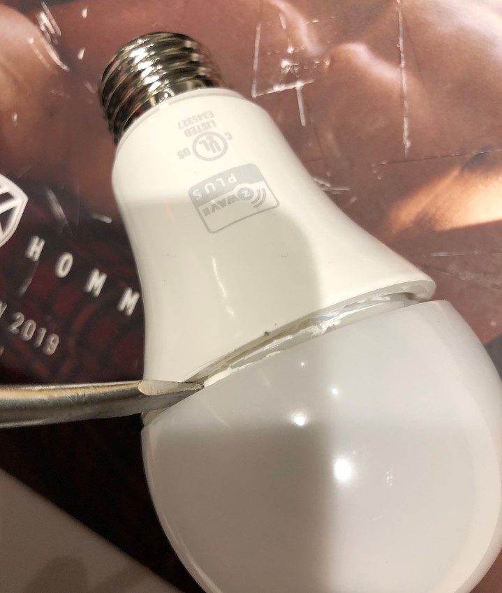

# Do-it-yourself: Smart IKEA EVEDAL

Recently while shopping at IKEA, I saw a table lamp which look great à 30$ instead of 200$ CAD. The only thing is that it was a dumb lamp, while all light in my house are now smart.

So here is my work to make it a bit smarter!

> Note: For this original work, I only replaced the bulb socket by a standard E26. 
> The slider switch is no longer usable.
> I plan to reuse it using an ESP-8266, but it's not part of this work!

## Material
* A smart bulb **with plastic cap** (cf. point 18 and 19) eg. [Inovelli Ilumin](https://inovelli.com/products/bulbs-ilumin/) or [IKEA TRADFRI](https://www.ikea.com/ca/en/p/tradfri-led-bulb-e26-600-lumen-wireless-dimmable-color-and-white-spectrum-color-and-white-spectrum-globe-opal-white-90408617/);
* A [bulb socket](https://www.homedepot.ca/product/atron-porcelain-socket-with-leads/1000424526);
* A 1/4 x 1.5-inch bolt;
* Basic tools!

## Step by step
1.	The first step is to remove the LED bulb, you only have to pull it

	

2.	Then we have to remove the switch. It’s only screwed in the lamp’s base, but it’s a bit hard to unscrew it. I used a pliers with piece of plastic warp to protect the slider.

	

	

	

3.	Next step is to remove the bottom pad with a cutter

	
	
	
	
	

4.	To dismount the base, you need to give more cable by pushing it inside, then you only have to pull it from the bottom.

	

	> Note: On the first lamp I modified, the cable was locked by a small clip on the side
	>
	> 
	> *	Push the cable from outside in the base;
	> *	Using a screwdriver, pull the cable above the clip to give enough space to remove it;
	> *	Remove this clip;
	> *	Then push back the cable inside

	

	

5.	Unplug the power adapter and cut the 2 wires that are going through the base to the top of the light

	

6.	Unscrew the plastic nut, and dismount the plate on top

	

	

7.	Unscrew the two small screws on the side of the bulb socket and pull it off

	

	

8.	Drill 2 holes in the plate to pass the new wires

	

9.	Now it’s time to mount the new bulb socket!

	The main issue here is that it usually comes ready to be mounted on a classic lamp thread, which we don’t have and would be harder to fit.

	

	Instead, I unscrew the small support under the socket, and using some pliers I “reversed” it to fit in the hole of the plastic plate of the lamp.

	

10.	Mount the reversed support using the bolt on the plastic plate

	

11.	And finally fix the new socket on the support

	

12.	Using the plastic nut, screw it back to the base of the lamp

	

13.	Time to wire it! Cut the plastic protection and dismount the electrical connector

	

	

14.	Connect the 2 wires of the socket, put back the connector (or use new one!), and wrap it in electrical tape

	

15.	Push everything back into the base

	> Note: Here I kept the power adapter but disconnected it (I moved the power connector in whole on the side). The idea (for a next how-to) will be to use a small ESP8266 to re-use the original switch to control the lamp.

	

16.	Screw back the switch and make sure that everything is well aligned (move the slider up and down, manipulation should be smooth).

	

17.	Screw the smart bulb and plug the lamp in the wall to validate that everything is ok.

	

18.	The surprise steps … all bulbs I’ve tested (Phillips Hue, IKEA TRÅDFRI, and Innovelli Ilumin) are slightly to big to fit in the lamp 😣. So we have to remove the cap of the bulb!

	

19.	Using a cutter, either cut (IKEA TRÅDFRI) or separate (Innovelli Ilumin) the cap of the bulb.

	> WARNING: Make sure the cap of the bulb is in plastic! Apparently, it’s in glass for the Phillips Hue, so I didn’t tried!

	

	

	

20.	Enjoy!

	

	

	

